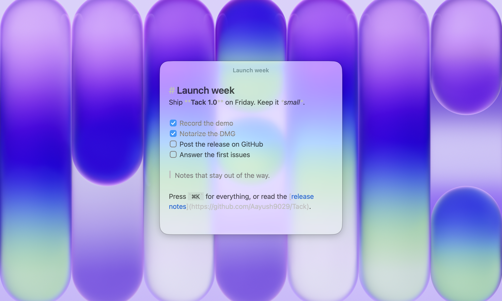

  
  <h1 align="center">Tack</h1>

  Glass sticky notes for the Mac, written in Markdown.

  
  

  

## Install

Download the DMG from [Releases](https://github.com/Aayush9029/Tack/releases/latest), open it, and drag Tack to Applications. Tack needs macOS 26 or later.
