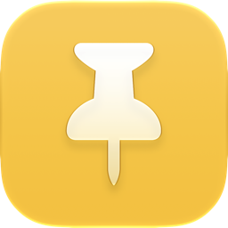
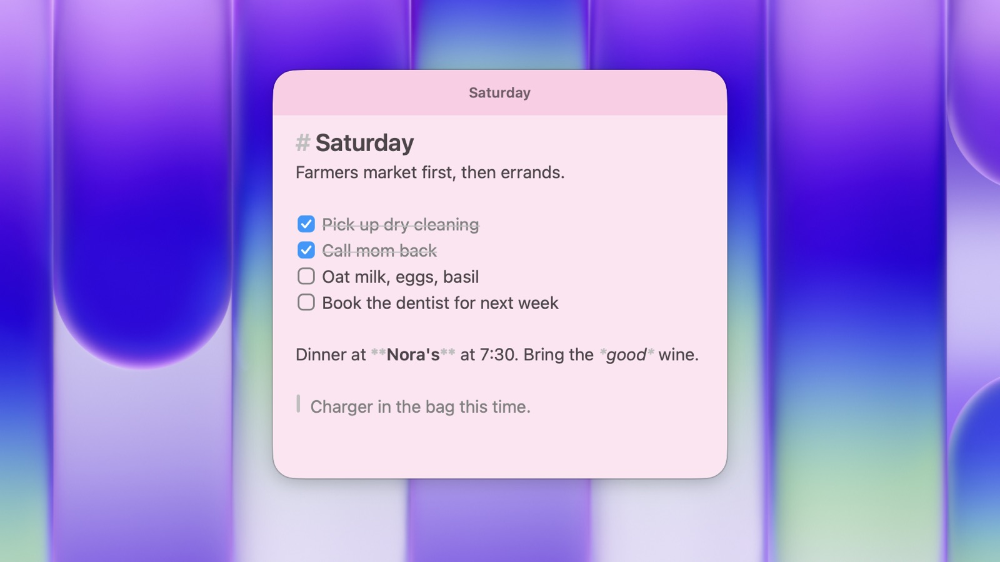

  
  <h1 align="center">Tack</h1>

  High-performance sticky notes for the Mac.

  
  

  

## Features

- Liquid Glass or classic paper notes, each with its own tint, that float above your windows when pinned.
- Checklists, headings, links, code, images and video, styled as you type.
- ⌘K for every command, a swipe to flip between notes, a grid of every note, and a full-screen focus mode.
- A `tack` command, so scripts and agents can read and write your notes.

## Install

Download the DMG from [Releases](https://github.com/Aayush9029/Tack/releases/latest), open it, and drag Tack to Applications. Tack needs macOS 26 or later.
